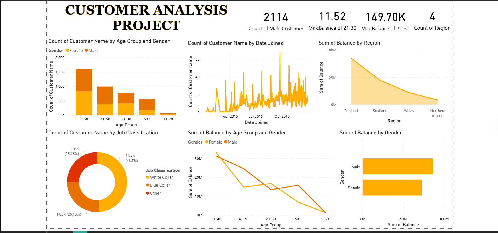

# Customer Analysis Dashboard | Power BI

## 📊 Project Overview
This Power BI dashboard analyzes customer demographics, balance distribution, and regional performance. 
The objective is to identify high-value customer segments and generate insights for business decision-making.

---

## 🎯 Business Objectives
- Analyze customer distribution by age and gender
- Evaluate balance contribution by region
- Track customer joining trends
- Understand job classification breakdown
- Compare balance distribution by gender

---

## 📌 Key KPIs
- Total Customers: 2114
- Maximum Balance (Age 21–30): 149.70K
- Regional Coverage: 4 Regions
- Balance Distribution by Gender

---

## 🛠 Tools Used
- Power BI
- DAX
- Excel (Data Preparation)

---

## 📈 Insights
- Age group 31–40 has the highest customer count.
- England region contributes the highest total balance.
- Male customers hold slightly higher total balances.
- Majority of customers belong to White Collar job classification.
- Customer acquisition trend shows steady growth.

---

## 📊 Dashboard Preview

